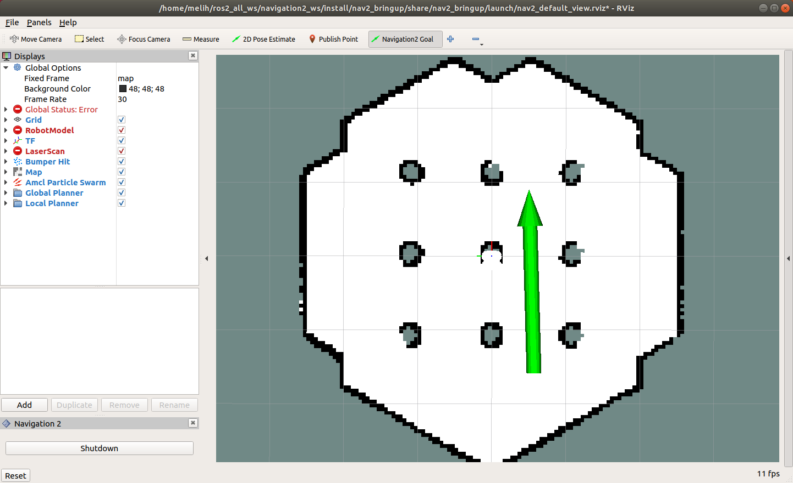

# Navigation2 with Turtlebot 3 in Gazebo

- [Overview](#overview)
- [Requirments](#requirements)
- [Navigation2 with Turtlebot 3 in Gazebo](#navigation2-with-turtlebot-3-in-gazebo)
- [Videos](#videos)

# Overview:

This tutorial shows how to control and navigate Turtlebot 3 using the ROS2 Navigation2 in Gazebo. Turtlebot is a low-cost, personal robot kit with open-source software (ROS2). Turtblebot robots are widely supported by the ROS community. You can find many applications and examples of Turtlebot projects on the Internet. You can find more information about Turtlebot3 [here.](http://emanual.robotis.com/docs/en/platform/turtlebot3/overview/)

Links to the robot kits and Github repo.

- [Turtlebot Burger](http://www.robotis.us/turtlebot-3-burger-us/)
- [Turtlebot Waffle](http://www.robotis.us/turtlebot-3-waffle-pi/)
- [Turtlebot 3 Github](https://github.com/ROBOTIS-GIT/turtlebot3)

This tutorial consists of two parts. In the first part, you will learn how to use Turtlebot 3 robots in simulation (Gazebo). And in the second part, you will learn how to control a real Turtlebot Waffle using Navigation2.

```ROS2 Dashing``` and ```Navigation2 Dashing 0.2.4``` are used to create this tutorial.

This tutorial may take about 1-2 hours to complete. It depends on your experience with ROS, robots, and what computer system you have.

## Requirements:

- [Install ROS2](https://index.ros.org/doc/ros2/Installation/)

- Install Navigation2

    - ```sudo apt install ros-<ros2-distro>-navigation2```

- Install Turtlebot 3 

    - ```sudo apt install ros-<ros2-distro>-turtlebot3*```

- [Setup Turtlebot 3](http://emanual.robotis.com/docs/en/platform/turtlebot3/ros2/#setup)

## Navigation2 with Turtlebot 3 in Gazebo

### 0- Setup Your Enviroment Variables

Run the following commands whenever you open a new terminal during this tutorial. 

- ```source /opt/ros/<ros2-distro>/setup.bash```
- ```export TURTLEBOT3_MODEL=waffle```
- ```export GAZEBO_MODEL_PATH=$GAZEBO_MODEL_PATH:/opt/ros/dashing/share/turtlebot3_gazebo/models```

## Short-cut 

If you don't have the time to go through all the steps and only want to try Navigation2 in simulation, there is a solution for that. After setting up your system variables, if you don't want to go through the step by step launch instructions, you can use the launch file that does all the steps that are explained in the next sections for you.

- ```ros2 launch nav2_bringup nav2_tb3_simulation_launch.py```

This launch file is going to launch Gazebo, Turtlebot3 specific nodes, Navigation2 and RViz2. Once you see everything launced, you can jump to step 5.

### 1- Launch Gazebo

Now, launch Gazebo with the world model, open a new terminal and type

    gazebo --verbose -s libgazebo_ros_init.so /opt/ros/dashing/share/turtlebot3_gazebo/worlds/turtlebot3_worlds/waffle.model

Once, Gazebo is launched, you should see the Turtlebot3 world and Turtlebot 3 Waffle.

If Gazebo fails to start, run the following commands and try to launch Gazebo again.

    killall gzserver
    killall gzclient


### 2- Launch Turtlebot 3 Robot State Publisher
 
Launch Turtlebot 3 specific nodes,

    ros2 launch turtlebot3_bringup turtlebot3_state_publisher.launch.py use_sim_time:=True

Make sure use_sim_time is set to **True**.

### 3- Launch Navigation2 

Launch Navigation 2. If you set `autostart:=False`, you need to click on the start button in RVIZ to initialize the nodes. Make sure `use_sim time` is set to **True**, because we want to use the time simulation time in Gazebo instead of the system time.

turtlebot3_world.yaml is the configuration file for the map we want to provide Navigation2. In this case, it has the map resolution value, threshold values for obstacles and free spaces, and a map file location.

```
ros2 launch nav2_bringup nav2_bringup_launch.py use_sim_time:=True autostart:=False map:=/opt/ros/dashing/share/nav2_bringup/launch/turtlebot3_world.yaml
```

### 4-  Launch RViz

Launch RVIZ with a pre-defined configuration file.

    ros2 run rviz2 rviz2 -d $(ros2 pkg prefix nav2_bringup)/share/nav2_bringup/launch/nav2_default_view.rviz

Now, you should see a shadow of Turtlebot 3 robot model in the center of the plot in RViz. Click on the Start button (Bottom Left) if you set the auto_start parameter to false.


Now, the map should appear in RViz.


### 5- Initialize the location of Turtlebot 3

First, find where the robot is in Gazebo. You can see where the robot's initial position in Gazebo.


Set the pose of the robot in RViz. Click on the 2D Pose Estimate button and point the location of the robot on the map. The direction of the green arrow is the orientation of Turtlebot.
  


Now, the 3D model of Turtlebot should move to that location. A small error in the estimated location is tolerable.

### 6-  Send a Goal Pose

Pick a target location for Turtlebot on the map. You can send Turtlebot 3 a goal position and a goal orientation by using the **Navigation2 Goal** and the **GoalTool** buttons.

*Note*: Difference between buttons. Navigation2 Goal button uses a ROS2 Action to send the goal and GoalTool publishes the goal to a topic.


Once you define the target pose,  Navigation2 will find a global path and start navigating the robot on the map.


You can also observe that Turtlebot 3 moves in the simulated environment in Gazebo as well.


### Next Tutorial 

[Navigation2 on Real Turtlebot 3](navigation2_with_turtlebot3_in_gazebo.md)

## Videos


