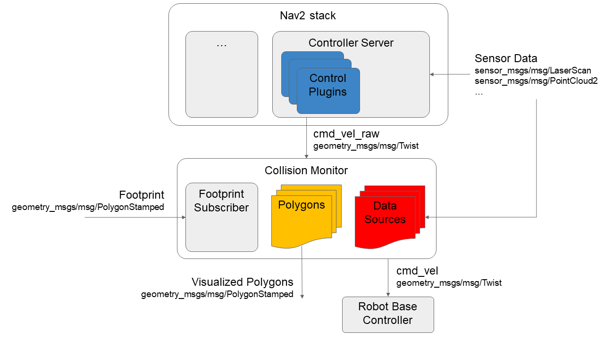

# Nav2 Collision Monitor

Collision Monitor - is an independent layer in Nav2 providing an additional level of robot safety assurance.
It allows performing robot collision avoidance by monitoring the obstacles in surrounding environments laying in collision proximity to the robot.

This is extremely useful and integral part of large heavy industrial robots operating in the facilities, or of robots moving with high velocities, where the collision with any obstacle might cause unpredictable severe consequences.

## Features

Collision Monitor operates by means of areas exposed around the robot and moving with it.
The obstacles fell into such area are forcing robot to stop, operate slowly or even fluently approach an obstacle with a constant time to the collision.

The following models of safety behaviors are employed by Collision Monitor:

* **Stop model**: Define a zone and a point threshold. If more that `N` obstacle points appear inside this area, stop the robot until the obstacles will disappear.
* **Slowdown model**: Define a safety area around the robot and slow the maximum speed for a `%S` percent, if more than `N` points will appear inside the area.
* **Approach model**: With the current robot speed, estimate the time to collision to points obtained from sensors. If the time is less than `M` seconds (0.5, 2, 5, etc...), slow the robot until it will be equal to `M` seconds. The effect here would be to keep the robot always `M` seconds from a collision and continuously scale down its speeds.

The safety area around the robot can take the following shapes:

* Arbitrary user-defined polygon around the robot for usage in stop and slowdown models.
* Robot footprint polygon, which is used in the approach behavior model only.
* Circle, used in all models: for stop and slowdown models as a safety area, for approach model as a robot footprint. Circle is made for the best performance and could be used in the cases where the safety area or robot could be approximated by round shape.

NOTE: Although safety behavior models are not intended to be used simultaneously (e.g. stop model should not be crossed with approach one), it is not prohibited to. Collision Monitor allows setting simultaneously multiple shapes with different behavior models. This typically could be useful to have a small stop area and larger slowdown bounding box to warn the robot from a collision without termination of operation.

The obstacle points are being obtained from different data sources. Collision Monitor is subscribed to:

* Laser scanners (`sensor_msgs::msg::LaserScan` messages)
* PointClouds (`sensor_msgs::msg::PointCloud2` messages)
* IR/Sonars (`sensor_msgs::msg::Range` messages, not implemented yet)

## Design

Since Collision Monitor is designed to operate as an independent safety node, Nav2 stack has no knowledge about it.
It is laying under the stack and operating after all necessary decisions were made by Nav2.
This is achieved through remapped `cmd_vel` topic, going out from a Controller.

The following diagram is showing the high-level design of Collision Monitor module. All shapes (Polygons and Circles) are derived from base `Polygon` class, so without loss of generality we can call them as polygons. Subscribed footprint is also having the same properties as other polygons, but it is being obtained from `nav2_costmap_2d::FootprintSubscriber`.

## Configuration

Detailed configuration parameters, their description and how to setup a Collision Monitor could be found at its [Configuration Guide](https://navigation.ros.org/configuration/packages/configuring-collision-monitor.html) and [Using Collision Monitor tutorial](https://navigation.ros.org/tutorials/docs/using_collision_monitor.html) pages.

## Metrics

Designed to be used in wide variety of robots (incl. moving fast) and have a high level of reliability, Collision Monitor node should operate at fast rates.
Typical one frame processing time is ~4-5ms for laser scanner (with 360 points) and ~4-80ms for PointClouds (having 24K points).
The table below represents the details of operating times for different behavior models and shapes:

| | Stop/Slowdown model, Polygon area | Stop/Slowdown model, Circle area | Approach model, Polygon footprint | Approach model, Circle footprint |
|-|-----------------------------------|----------------------------------|-----------------------------------|----------------------------------|
| LaserScan (360 points) processing time, ms  | 4.09 | 4.08 | 4.98  | 4.29  |
| PointCloud (24K points) processing time, ms | 4.13 | 3.76 | 77.92 | 11.43 |

The following notes could be made:

 * Due to faster algorithms, circle shapes are preferred for the approach behavior models.
 * More points mean lower performance. Pointclouds could be sparsed before Collision Monitor node for the systems with lack of computational resources.
