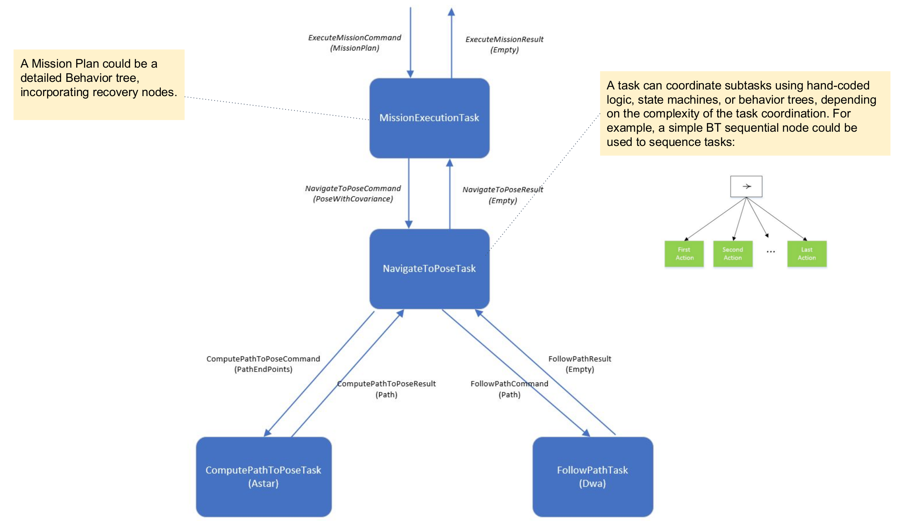

# Dijkstra Planner
The DijkstraPlanner is an implementation of a [Planning module](../doc/requirements/requirements.md) (equivalent to GlobalPlanner in ROS1 [MoveBase](http://wiki.ros.org/move_base)).

The Planning module is responsible for generating a feasible path given start and end robot poses.

Dijkstra’s algorithm is guaranteed to find the shortest path under any condition.

## Status
Currently, DijkstraPlanner is a direct port from ROS1 MoveBase [Navfn](http://wiki.ros.org/navfn) planner.

The Navfn planner assumes a circular robot and operates on a costmap to find a minimum cost plan from a start point to an end point in a grid. The navigation function is computed with Dijkstra's algorithm. The strategy is based on [High-Speed Navigation Using
the Global Dynamic Window Approach](https://cs.stanford.edu/group/manips/publications/pdfs/Brock_1999_ICRA.pdf) Brock, O. and Oussama K. IEEE (1999)

## Task Interface

The [Navigation System]((../doc/requirements/requirements.md)) is composed of three tasks: NavigateToPose, ComputePathToPose and FollowPathToPose.

The DijkstraPlanner implements the Task Server interface for ComputePathToPose, specifically derives from `nav2_tasks::ComputePathToPoseTaskServer`. The client to DijkstraPlanner is 'NavigateToPoseTask', which periodically sends requests to the path planner.

## Next Steps
- Refactor Navfn. Currently difficult to modify/extend.
- Implement additional planners based on optimal control, potential field or other graph search algorithms that require transformation of the world model to other representations (topological, tree map, etc.) to confirm sufficient generalization.
- Implement planners for non-holonomic robots.
